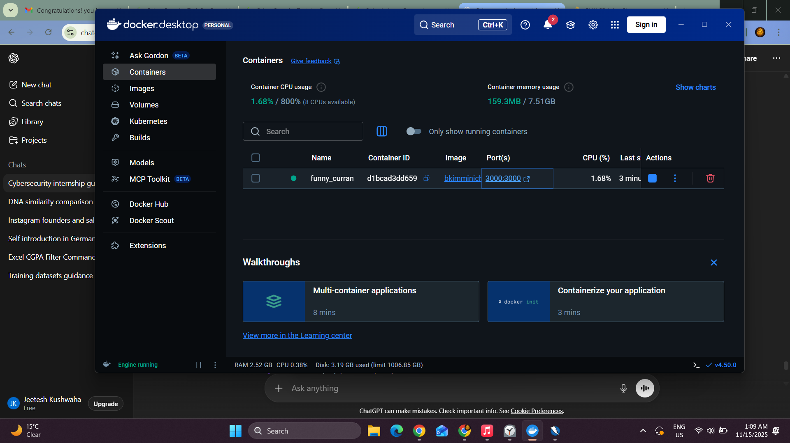

# 🚀 FUTURE_CS_01 – Web Application Security Testing (OWASP Juice Shop)

## 📌 Overview  
As part of my cybersecurity internship with **Future Interns**, this task focused on performing **Web Application Security Testing** using the intentionally vulnerable application **OWASP Juice Shop**.  
The main objective was to simulate real-world penetration testing, identify vulnerabilities, intercept traffic using Burp Suite, and document findings in a professional security report.

---

## ✅ Key Highlights  
- Successfully deployed **OWASP Juice Shop using Docker** on Windows 11  
- Configured **Burp Suite** to intercept and analyze HTTP/HTTPS traffic  
- Explored and mapped vulnerabilities to **OWASP Top 10**  
- Identified key issues including:  
  - Broken Authentication  
  - Reflected XSS (attempted)  
  - Unauthorized Access to Admin pages  
  - Security Misconfigurations  
- Captured all requests using Burp Suite’s intercept and HTTP history  
- Compiled a professional **Security Assessment Report (PDF)** with screenshots  

---

## 🎯 Skills Gained  
- Web Application Penetration Testing  
- OWASP Top 10 Vulnerability Analysis  
- Burp Suite Traffic Interception  
- Vulnerability Enumeration & Exploitation  
- Security Documentation & Reporting  

---

## 🛠️ Tools Used  
- **OWASP Juice Shop (Docker Container)**  
- Docker Desktop (Windows 11)  
- Burp Suite Community Edition  
- Chromium Browser (Burp-controlled)  
- FoxyProxy (Alternative proxy setup)  

---

## 📁 Deliverables  
- **Report.pdf** – Full Vulnerability Assessment Report  
- **/screenshots/** – Evidence, intercepted requests, tool outputs  
- (Optional) Burp Site Map & Proxy Logs  

---

## 🧪 Vulnerabilities Explored  
- Login Brute-force / Broken Authentication  
- Reflected XSS (Search input)  
- Unauthorized Admin Access Attempt  
- General Misconfigurations  

---

## 📸 Screenshots  
Screenshots folder includes:
- Docker Setup
- 
- Burp Suite request interception
-  
- HTTP request/response logs  
- Login attempts  
- Admin page protection  
- Vulnerability proof & analysis  

---

## 📜 Conclusion  
This task strengthened my understanding of **real-world web application security**, enhanced my practical Pentesting skills, and improved my ability to document vulnerabilities in a structured, professional format suitable for clients or employers.

---

### ⭐ If you like this project, consider giving the repo a star!
